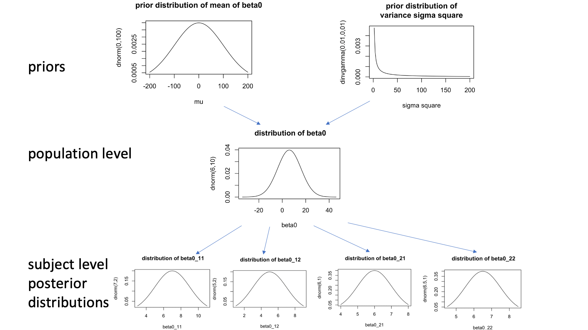

```{r setup, include=FALSE}
knitr::opts_chunk$set(echo = TRUE)
```

## Outline

- Section 1: Background knowledge of estimating respiratory virus attributable disease burden (hospitalizations/mortality etc) with statistical models.
\
\
- Section 2: Background knowledge of Hierarchical Bayesian regression
\
\
- Section 3: Hierarchical Bayesian regression to estimate RSV attributable hospitalizations in older adults by age and risk groups and its R code.

**Note: In this tutorial, we will focus on using time-series data. Therefore, we will not introduce other methods to estimate disease burden such as the disease pyramid.** For other methods, please check out Ginny's class *quantitative method in infectious disease epidemiology* and Dan's class *Public Health Surveillance*. 

## Section 1: Background knowledge of estimating respiratory virus attributable disease burden with statistical models.

There are 5 main statistical methods to estimate the hospitalization/mortality attributable to respiratory virus infection. In Dan's class, Public Health Surveillance, he teaches all four methods in details. Here, we will only give a brief introduction to each of the method and provide the link to the initial publications.
\
\

1. **Serfling regression** 

2. **Periseason differences**

3. **Poisson regression with log link**

4. **Negative binomial regression with identity link**

5. **Box-Jenkins transfer function (ARIMA model)**

## Brief introduction to serfling regression and periseason differences

1.**Serfling regression** \
  This type of model identifies the epidemic season and establish a epidemic threshold (seasonal baseline) using historical data. After predicting the expected diseases baseline, observed diseases above the baseline (epidemic threshold) during the epidemic season will be attributable to the viral infection. The basic Serfling regression is given by: $Y_t = \mu+ bt+\sum \alpha_i cos \theta+ \sum \beta_i sin \theta$ where $Y_t$ is the expected hospitalizations at time t. $\mu$ is the baseline. $bt$ captures time trend. $\sum \alpha_i \cos \theta+ \sum \beta_i \sin \theta$ are for the seasonal variations. Serfling regression is a linear model initially using ordinary least square to fit. [\color{blue} Click to see an R code example](https://kmcconeghy.github.io/flumodelr/articles/04-serfling.html)
  \
  \
2.**Periseason differences**\
 This method calculate the hospitalizations attributable to influenza based on the differences in the hospitalization rates when respiratory virus was circulating and the hospitalization rates when there was no respiratory virus circulation in the community.
   \
  \
  
## Brief introduction to poisson regression with log link

3.**Poisson regression with log link**
\
  Poisson regression is used to model count variables. Therefore, it can be used to model the number of hospitalizations over time. The logarithm of the expected value of the count variable is modeled as a linear combination of the predictor variables. For example, in Thompson's paper^[Thompson WW, Shay DK, Weintraub E, et al. Mortality Associated With Influenza and Respiratory Syncytial Virus in the United States. JAMA. 2003;289(2):179–186. doi:10.1001/jama.289.2.179], the poisson regression with log link is given by: \small
  $$Y = \alpha \exp^{(\beta_0 + \beta_1t + \beta_2t^2  +  \beta_3 \sin(2\pi/52) + \beta_4 \cos(2\pi/52) + \beta_5 Flu_A(H1N1) + \beta_6 Flu_A(H3N2) + \beta_7Flu_B + \beta_8RSV)}$$ 
  In this example, $Y$ is the observed number of deaths/hospitalization in a particular week, $\alpha$ is the population size as an offset term,$\beta_0$ is the baseline hospitalization incidence, $\beta_1t + \beta_2t^2$ represents the long-term trend of hospitalizations, $\sin(2\pi/52) + \beta_4 \cos(2\pi/52)$ captures the annual seasonal variations of hospitalizations, the rest are the pathogens that can contribute to the increase of the observed hospitalizations.    

## Brief introduction to negative binomial regression with identity link

4.**Negative binomial regression with identity link**
\
Negative binomial regression is also used to model count variables. It is a generalization of the poisson regression, in which the variance is assumed to be equal to the mean. The new approach use an identity link instead of an log link because log link corresponds to a multiplicative relationship among covariates (including baseline hospitalizations, seasonality, and several respiratory viruses) while identity link assumes additive effects. Apparently, additive effects are more realistic than multiplicative effects. The negative binomial regression with identity link is given by:  
\small$$Y \sim NB(p,r), \space p = \frac{r}{r+\lambda}$$
\small$$\lambda=\beta_0 + \beta_1t + \beta_2t^2  +  \beta_3 \sin(2\pi/52) + \beta_4 \cos(2\pi/52) + ... + \beta_8RSV$$ 

where $Y$ is the number of observed failures (diseases), $p$ is the probability of success (survival/not infected), $r$ is the number of successes (survival/not infected) and $\lambda$ is the expected value of failures (diseases). All other parameters remain the same as what we introduced in Poisson regression.

## Brief introduction to ARIMA model

5.**Autoregressive integrated moving average (ARIMA) model**
\
ARIMA model can account for the autorcorrelation of the time-series and also the time-delayed associations. For infectious diseases, the number of the infected individuals in the next time point is correlated with the number of the infected individuals currently. This phenomenon is described as autocorrelated. The influenza infection reported this week may contribute to hospitalizations next week, which means the time-delayed associations. For example, in Gilca's paper^[\tiny Rodica Gilca, Gaston De Serres, Danuta Skowronski, Guy Boivin, David L. Buckeridge, The Need for Validation of Statistical Methods for Estimating Respiratory Virus–Attributable Hospitalization, American Journal of Epidemiology, Volume 170, Issue 7, 1 October 2009, Pages 925–936, https://doi.org/10.1093/aje/kwp195], ARIMA model is given by: 
\small
$$Y_t=\alpha_0 + \alpha_1Temp_t + \alpha_2Holiday_t + \beta_1Flu_t + \sum_{i=0}^2\omega_iRSV_{t-i}$$
$Y_t$ is the observed number of hospitalizations in a particular week $t$, $\alpha_0$ is the baseline hospitalization incidence,$\alpha_1Temp_t + \alpha_2Holiday_t$ are the hospitalizations attributable to seasonal changes and holiday gathering, $\beta_1Flu_t$ is the flu attributable hospitalizations, and $\sum_{i=0}^2\omega_iRSV_{t-i}$ is the RSV attributable hospitalizations. **This example suggested that not only RSV infections this week but also RSV infections reported 1 week and 2 weeks ago associates with hospitalizations reported this week.** 


## Initial publications of the method

1. **Serfling regression**
  - [Methods for Current Statistical Analysis of Excess Pneumonia-influenza Deaths](https://www.ncbi.nlm.nih.gov/pmc/articles/PMC1915276/pdf/pubhealthreporig00078-0040.pdf)
  - [The impact of influenza epidemics on mortality: introducing a severity index](https://ajph.aphapublications.org/doi/epdf/10.2105/AJPH.87.12.1944)
  - [Impact of Influenza Vaccination on Seasonal Mortality in the US Elderly Population](https://jamanetwork.com/journals/jamainternalmedicine/article-abstract/486407)

2. **Periseason differences**
  - [The effect of influenza on hospitalizations, outpatient visits, and courses of antibiotics in children](https://www.nejm.org/doi/full/10.1056/nejm200001273420401)
  - [Respiratory illness associated with influenza and respiratory syncytial virus infection](https://adc.bmj.com/content/archdischild/90/7/741.full.pdf)
  - [Influenza and the Rates of Hospitalization for Respiratory Disease among Infants and Young Children](https://www.nejm.org/doi/full/10.1056/nejm200001273420402)
  - [Impact of influenza and respiratory syncytial virus on mortality in England and Wales from January 1975 to December 1990](https://www.cambridge.org/core/services/aop-cambridge-core/content/view/28087EC2F43E75D1907F15CA3411FE6D/S0950268800058957a.pdf/impact-of-influenza-and-respiratory-syncytial-virus-on-mortality-in-england-and-wales-from-january-1975-to-december-1990.pdf)

## Initial publications of the method (continued)

3. **Poisson regression with log link**
  - [Mortality Associated With Influenza and Respiratory Syncytial Virus in the United States](https://jamanetwork.com/journals/jama/article-abstract/195750)
  - [The Association of Respiratory Syncytial Virus Infection and Influenza with Emergency Admissions for Respiratory Disease in London: An Analysis of Routine Surveillance Data](https://academic.oup.com/cid/article/42/5/640/316492)

4. **Negative binomial regression with identity link**
  - [Modelling the unidentified mortality burden from thirteen infectious pathogenic microorganisms in infants](https://www.cambridge.org/core/journals/epidemiology-and-infection/article/modelling-the-unidentified-mortality-burden-from-thirteen-infectious-pathogenic-microorganisms-in-infants/26AE7DA522FD6DCE6CE3E4F2D3CB9A79)
  - [Hospitalization Attributable to Influenza and Other Viral Respiratory Illnesses in Canadian Children](https://journals.lww.com/pidj/fulltext/2006/09000/Hospitalization_Attributable_to_Influenza_and.8.aspx)

5. **Autoregressive integrated moving average (ARIMA) model**
  - [Community influenza outbreaks and emergency department ambulance diversion](https://www.sciencedirect.com/science/article/pii/S0196064403013167)
  - [Time-Series Analysis of the Relation between Influenza Virus and Hospital Admissions of the Elderly in Ontario, Canada, for Pneumonia, Chronic Lung Disease, and Congestive Heart Failure](https://academic.oup.com/aje/article/149/1/85/205393)


## Other useful references

- [The Need for Validation of Statistical Methods for Estimating Respiratory Virus–Attributable Hospitalization](https://academic.oup.com/aje/article/170/7/925/91526)

## Section 2: Background knowledge of using Hierarchical Bayesian regression to estimate RSV attributable hospitalizations
The benefits of using a Hierarchical Bayesian structure is that it can shrink the uncertainty of inference while allow between-group variability. 
\
\
For example, if we would like to estimate the baseline hospitalizations $\beta_{0jk}$ in age $j$ and socioeconomic group $k$, we can treat this parameter as (1) independent, meaning that the baseline hospitalizations are different in each group and we will need to estimate 27 parameters $\beta_{0j=1,k=1}$, $\beta_{0j=1,k=2}$...$\beta_{0j=9,k=3}$, (2) the same, meaning that the baseline hospitalizations are the same in all age and socioeconomic group and we will  estimate one parameter $\beta_0$, and (3) random draws from the a normal distribution, meaning that baseline hospitalizations are normally distributed in the whole population and baseline hospitalization of each subpopulation $jk$ is an realization of the distribution (a point in the distribution). In this case, we will estimate the mean and variations of the normal distribution and then get the subpopulation estimates.
 
## Background knowledge of Hierarchical Bayesian regression: Benefits

If we model the parameters in Bayesian framework, the third scenario corresponds to a Hierarchical Bayesian model.
\
\
Compared with treating the parameters as group-specific, Bayesian Hierarchical structure pools information across groups to help shrink the uncertainty of the single group estimates. 
\
\
Compared with treating the group specific parameters as homogeneous, Bayesian Hierarchical structure gives the flexibility and possibility of estimating group specific parameters. It can help evaluate the hypothesis of between-group variation.

## Visualization of a Hierarchical Bayesian structure: 



```{r,eval=FALSE,echo=FALSE}
curve(dnorm(x, 0, 100), from=-200, to=200,main="prior distribution of mean of beta0",xlab="mu",ylab="dnorm(0,100)")
curve(dinvgamma(x, shape=0.01, rate = 0.01, log = FALSE), from=0, to=200,ylab="dinvgamma(0.01,0,01)",main="prior distribution of\nvariance sigma square",xlab="sigma square")
```


## Further readings on Hierarchical Bayesian regression

- [Bayesian hierarchical modeling by wikipedia](https://en.wikipedia.org/wiki/Bayesian_hierarchical_modeling)

- [Chapter 10 Bayesian Hierarchical Modeling by Drs. Jim Albert and Jingchen Hu](https://bayesball.github.io/BOOK/bayesian-hierarchical-modeling.html)

- [Hierarchical Bayesian Modeling by Dr. Angie Wolfgang](https://astrostatistics.psu.edu/RLectures/hierarchical.pdf)

## Section 3: Hierarchical Bayesian regression to estimate RSV attributable hospitalizations in older adults by age and risk groups and its R code.

\includepdf[pages=2]{Hier_Bay_figure.pdf}


## Hierarchical Bayesian regression structure

\includepdf[pages=3]{Hier_Bay_figure.pdf}

``` {=latex}
\end{frame}
\includepdf[pages=1-7]{model_structure.pdf}
\begin{frame}
```

## R code (JAGS code) for Hierarchical Bayesian regression structure

Please open Jags_model.R for the whole R script.
\
\
$k=1,2,3$ represent each socioeconomic groups, $j=1,...,9$ represent each age groups, and $i=1,...,108$ represent each month.
\
\
Hierarchical Bayesian model are specified in jags as follows:
```{r, eval=FALSE}
model {
for(k in 1:n.group){  
  for (j in 1:n.age){
      for (i in 1:n.date) { 
      
 y[i,j,k] ~ dnegbin(prob[i,j,k],r) 
 # negative binomial
  prob[i,j,k]<- r/(r+lambda[i,j,k])  ## likelihood 
```

## R code (JAGS code): expected respiratory hospitalizations

```{r, eval=FALSE}
# expected respiratory hospitalizations lambda
    lambda[i,j,k] <- rd0[j,k]+ # baseline hosp
exp(epi[epi.year[i]]) + # year to year variation
# epi.year[i] is an input indicator for the calendar year
# epi.year[i] = 1,2,...,9
exp(delta[month[i]]) + # monthly variations
# month[i] is an input indicator for the epi month
# month[i] = 1,2,...,12 (1 for July and 12 for June)
rsv[i,j,k]*rd2[j,k] + # RSV attributable hosp
flu[i,j,k]*rd1[epi.year[i],j,k] # flu attributable hosp
      }
    
# baseline hospitalizations 
#(must be greater than or equal to 0)
  rd0[j,k] <- exp(beta0[j,k])
  beta0[j,k]~ dnorm(mu0,tau0) 
# hierarchical structure: shared mean and variance
```

## The coefficient of flu in each age and SES group

```{r, eval=FALSE}
 for (p in 1:n.year) { 
# epi-year effects for antigen shift
# coefficient of influenza-associated respiratory 
# hospitalization varies annually 
    rd1[p,j,k] <- exp(beta1[p,j,k]) 
    # ensure positive coefs
    beta1[p,j,k] ~ dnorm(beta1_mean[p,j,k],tau.flu)
    # shared variance
    # the mean of the coefficient is 
# a multiplicative combination of 
    beta1_mean[p,j,k] <- gamma_flu[k]+ omega_flu[j]+ xi_flu[p]
    # SES effects gamma_flu[k]
    # age effects omega_flu[j]
    # epi-year (antigen) xi_flu[p]
    }
```

## The coefficient of RSV in each age and SES group

```{r, eval=FALSE}
 # this coefficient depends on SES and age 
    rd2[j,k] <- exp(beta2[j,k]) # ensure positive
    beta2[j,k] ~ dnorm(beta2_mean[j,k],tau.rsv)
    beta2_mean[j,k]<- gamma[k]+omega[j]
   # SES effects gamma[k]
  # age effects omega[j]
```

## hyperparameters

```{r, eval=FALSE}
# n.year = 1,2,...,9
for (p in 1:n.year) { 
epi[p] ~ dnorm(0, tau.epi) 
# prior for yearly variation of baseline hosp
xi_flu[p] ~ dnorm(0,tau7)}
# prior for flu annual variation (antigen shift) 

  for (m in 1:12){
    delta[m] ~ dnorm(0,disp.m)
  }
# prior for monthly variation of baseline hosp
```

## hyperparameters (continued)

```{r, eval=FALSE}
for(k in 1:n.group){
gamma_flu[k] ~ dnorm(0,tau3)
gamma[k] ~ dnorm(0, tau4)
}
# prior for SES effects of flu and RSV

for(j in 1:n.age){
omega[j] ~ dnorm(0, tau5)
omega_flu[j] ~ dnorm(0,tau6)
}
# prior for age effects of flu and RSV
```

## Priors
```{r, eval=FALSE}
 r ~ dunif(0,250) 
#r > 0 serves as an overdispersion parameter
  mu0 ~ dnorm(0,0.0001) # 0.0001 = 1/variance
# In jags, dnorm specify precision 
  
# the conjugate priors for variance of normal distribution
# is an inverse Gamma distribution
# In jags, we put priors on precision
  tau0 ~ dgamma(0.01, 0.01)
  tau1 ~ dgamma(0.01, 0.01)
  tau2 ~ dgamma(0.01, 0.01)
  tau3 ~ dgamma(0.01, 0.01)
  tau4 ~ dgamma(0.01, 0.01)
  tau5 ~ dgamma(0.01, 0.01)
  tau6 ~ dgamma(0.01, 0.01)
  tau7 ~ dgamma(0.01, 0.01)
  tau8 ~ dgamma(0.01, 0.01)
  tau.epi ~ dgamma(0.01, 0.01)
  tau.flu ~ dgamma(0.01, 0.01)
  tau.rsv ~ dgamma(0.01, 0.01)
  disp.m ~ dgamma(0.01, 0.01)
```

## Clarification for input data

**Note: we coded as rsv[i,j,k] and flu[i,j,k] for the purpose of a clear dimension for multiplication.**  This is a 1 to 1 multiplication, not a matrix multiplication. rsv[i,j,k] are the same for j=1,...,9, representing ICD-9 recorded RSV hospitalizations in children under 2 in each SES group in each month. flu[i,j,k] are the same for j=1,...,9, representing the total ICD-9 recorded flu hospitalizations in the entire age spectrum in each SES group in each month.

\
\ 

In the equation, we simplify them to $RSV_{ik}$ and $Flu_{ik}$.

## Specify input data

```{r, eval=FALSE}
epi.year <- as.factor(rep(1:9, each=12))
# indicator for calendar year
month <- rep(1:12,9)
# indicator for epi month (1 for July and 12 for June)

dataset <- list('y' = y_income_whole, 
# respiratory hospitalizations in each age and  
# SES group in each month
"rsv"=rsv_income_whole,
# ICD-9 recorded RSV hospitalizations   
# in children under 2 in each SES group in each month
"flu"=flu_income_whole, 
# the total ICD-9 recorded flu hospitalizations in 
# the entire age spectrum in each SES group in each month 
'epi.year'=epi.year,"month"=month,
n.age=9,n.date=108,n.year=9,"n.group"=3) 
# number of age/SES groups; number of months and years
```

## Posterior sampling

```{r, eval=FALSE}
jags_post <- jags.model(
  textConnection(model_string), 
  data = dataset,n.chains = 3)
# specify the number of chains

update(jags_post, n.iter=82500) # burn-in period

rsv_resp <- coda.samples(jags_post,
                         variable.names=
  c("rd2","lambda","rd1", "rd0","epi","delta"),
                      thin = 10,n.iter = 12500)
# posterior samples
```

## Estimate the RSV-attributable hospitalizations in each age and SES group

```{r, eval=FALSE}
## Remember to check convergence first
## use: gelman.diag() see 3_JAGS_Bayesian_model
## Calculate RSV attributable respiratory 
## hospitalization incidence and percent
  post1 <- as.data.frame(as.matrix(rsv_resp[[1]]))
  post2 <- as.data.frame(as.matrix(rsv_resp[[2]]))
  post3 <- as.data.frame(as.matrix(rsv_resp[[3]]))
  post <- bind_rows(post1,post2,post3)
## A total of 3750 posterior samples
  lambda <- post[, grep("lambda", colnames(post), fixed=T)]
  rd2.resp <- post[, grep("rd2[", colnames(post), fixed=T)]
  
rsv_count <- array(data = NA,dim = c(3750,108,9,3))
for (i in 1:108) {
  for (j in 1:9) {
    for (k in 1:3) {
      rsv_count[,i,j,k] <- rsv_income[i,j,k]*rd2.resp[,j+9*(k-1)]}}}
## posterior samples of RSV-attributable hospitalizations
## in each SES and age group in each month
```
